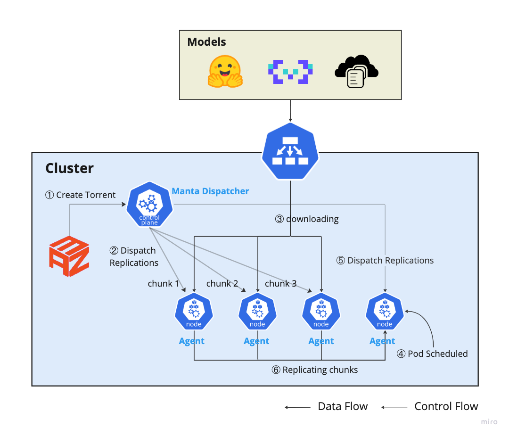

<p align="center">
  <picture>
    <source media="(prefers-color-scheme: dark)" srcset="https://raw.githubusercontent.com/inftyai/manta/main/docs/assets/logo.png">
    
  </picture>
</p>

<h3 align="center">
A lightweight P2P-based cache system for model distributions.
</h3>

[](https://github.com/mkenney/software-guides/blob/master/STABILITY-BADGES.md#alpha)
[![GoReport Widget]][GoReport Status]
[](https://github.com/inftyai/manta/releases/latest)

[GoReport Widget]: https://goreportcard.com/badge/github.com/inftyai/manta
[GoReport Status]: https://goreportcard.com/report/github.com/inftyai/manta

_Name Story: the inspiration of the name `Manta` is coming from Dota2, called [Manta Style](https://liquipedia.net/dota2/Manta_Style), which will create 2 images of your hero just like peers in the P2P network._


## Architecture



> Note: [llmaz](https://github.com/InftyAI/llmaz) is just one kind of integrations, **Manta** can be deployed and used independently.

## Features Overview

- **Preheat Models**: Models could be preloaded to the cluster, or even specified nodes to accelerate the model serving.
- **Model Caching**: Once models are downloaded, origin access is no longer necessary, but from other node peers.
- **Plug Framework**: _Filter_ and _Score_ extension points could be customized with plugins to pick the right peers.
- **Model LCM**: Manage the model lifecycles automatically with different configurations.
- **Memory Management(WIP)**: Specify the maximum reserved memory for use, and GC with LRU algorithm.

## Quick Start

### Installation

Read the [Installation](./docs//installation.md) for guidance.

### Preload Models

A toy sample to preload the `Qwen/Qwen2-7B-Instruct` model:

```yaml
apiVersion: manta.io/v1alpha1
kind: Torrent
metadata:
  name: torrent-sample
spec:
  replicas: 1
  hub:
    repoID: Qwen/Qwen2-7B-Instruct
```

If you want to preload the model to specified nodes, use the `NodeSelector`:

```yaml
apiVersion: manta.io/v1alpha1
kind: Torrent
metadata:
  name: torrent-sample
spec:
  replicas: 1
  hub:
    repoID: Qwen/Qwen2-7B-Instruct
  nodeSelector:
    zone: zone-a
```

If you want to remove the model weights once `Torrent` is deleted, set the `ReclaimPolicy=Delete`, default to `Retain`:

```yaml
apiVersion: manta.io/v1alpha1
kind: Torrent
metadata:
  name: torrent-sample
spec:
  replicas: 1
  hub:
    repoID: Qwen/Qwen2-7B-Instruct
  nodeSelector:
    zone: zone-a
  reclaimPolicy: Delete
```

More details refer to the [APIs](https://github.com/InftyAI/Manta/blob/main/api/v1alpha1/torrent_types.go).

## Roadmap

- GC policy with LRU algorithm
- More integrations with serving projects
- Support file chunking

## Contributions

🚀 All kinds of contributions are welcomed ! Please follow [CONTRIBUTING.md](./CONTRIBUTING.md).

**🎉 Thanks to all these contributors !**

<a href="https://github.com/inftyai/manta/graphs/contributors">
  
</a>
